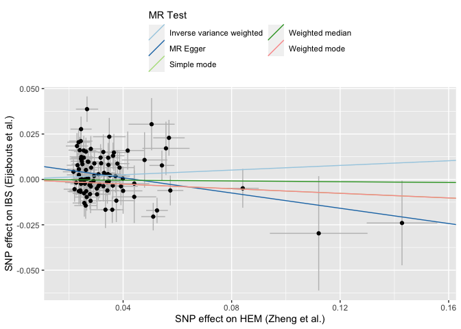
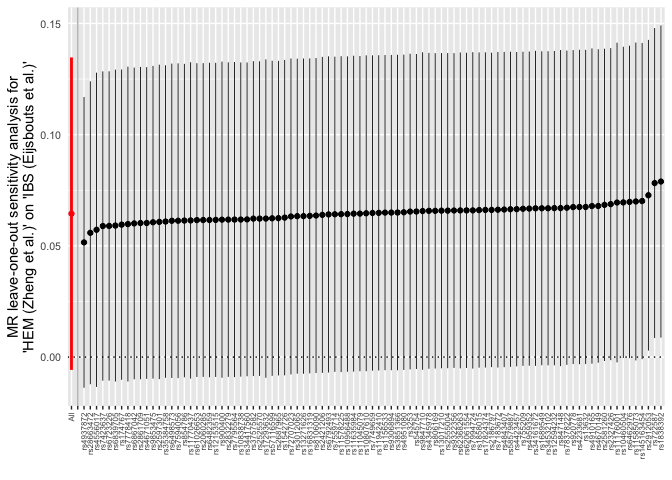
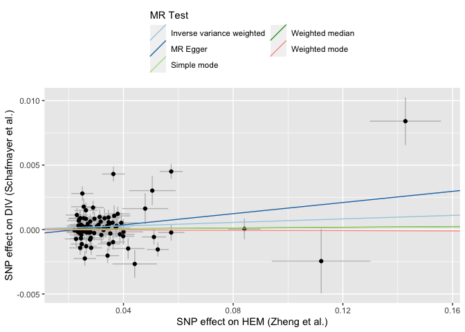
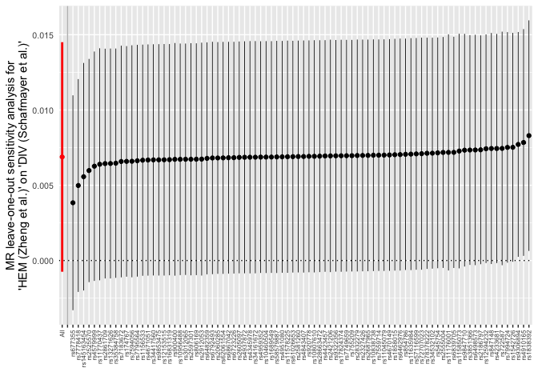
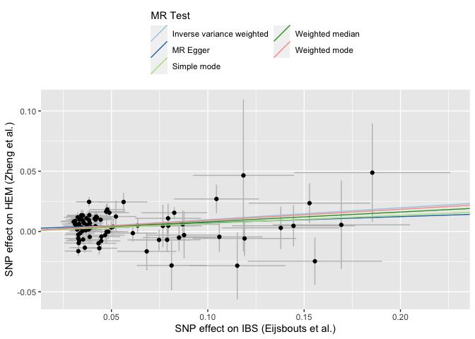
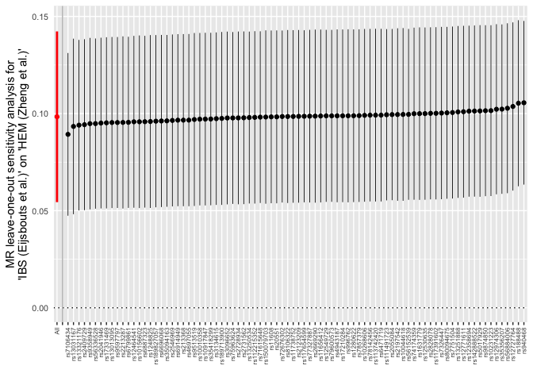
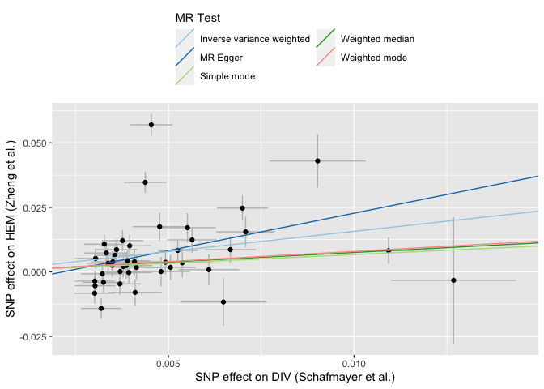
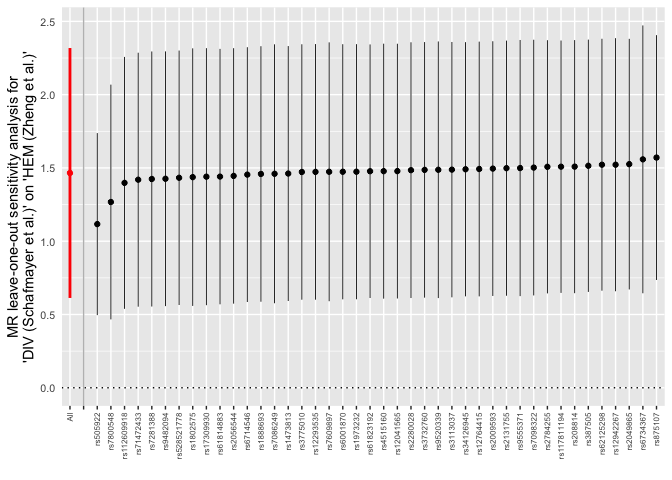

Bidirectional two-sample MR analysis
================

## GWAS summary statistics data

- HEM ([Zheng *et al.*](https://pubmed.ncbi.nlm.nih.gov/33888516/)) -
  GCST90014033
- DIV ([Schafmayer *et
  al.*](https://pubmed.ncbi.nlm.nih.gov/30661054/)) - GCST008105
- IBS ([Eijsbouts *et
  al.*](https://pubmed.ncbi.nlm.nih.gov/34741163/)) - GCST90016564

 

``` r
# libraries
library(tidyverse)
library(TwoSampleMR)
```

### Download files

``` r
##
## download files
##

ebi_ftp <- "http://ftp.ebi.ac.uk/pub/databases/gwas/summary_statistics/"

# DIV - GCST008105
# https://pubmed.ncbi.nlm.nih.gov/30661054/
download.file( 
  url = paste0(ebi_ftp,"GCST008001-GCST009000/GCST008105/GWAS_summary_1-23.dosages.maf_0.01.info_0.4.txt.gz"),
  destfile = "data/GWAS_summary_1-23.dosages.maf_0.01.info_0.4.txt.gz",
  method = "curl"
)

# IBS - GCST90016564 
# https://pubmed.ncbi.nlm.nih.gov/34741163/
download.file( 
  url = paste0(ebi_ftp,"GCST90016001-GCST90017000/GCST90016564/GCST90016564_buildGRCh37.tsv"),
  destfile = "data/GCST90016564_buildGRCh37.tsv",
  method = "curl"
)
# compress
R.utils::gzip(
  "data/GCST90016564_buildGRCh37.tsv",
  overwrite=TRUE
)

# HEM - GCST90014033
# https://pubmed.ncbi.nlm.nih.gov/33888516/
# can be accessed directly from the TwoSampleMR
```

## MR analysis

 

### Instrument variable selection

For the instrument variable (IVs) selection thresholds, we used the
`TwoSampleMR` workflow with the following parameters:

1)  p-value = 5e<sup>-08</sup> (if N (GWS loci) \> 10) or p-value =
    1e<sup>-05</sup> (if N (GWS loci) \< 10);
2)  LD - r<sup>2</sup> = 0.001 within 1Mb window (EUR);
3)  MR-PRESSO horizontal pleiotropy removal (outlier p-value \< 0.1)

 

### SNPs -\> HEM (exposure) -\> IBS (outcome)

``` r
## get instruments

# from OpenGWAS db
HEM_exp_dat <- extract_instruments(
  "ebi-a-GCST90014033",
  r2 = 0.001,
  kb = 1000
  ) %>% mutate(
    exposure = "HEM (Zheng et al.)"
  )
```

    ## API: public: http://gwas-api.mrcieu.ac.uk/

``` r
IBS_out_dat <- read_outcome_data(
  snps = HEM_exp_dat$SNP,
  filename = "data/GCST90016564_buildGRCh37.tsv.gz",
  sep = "\t",
  snp_col = "variant_id",
  chr_col = "chromosome", 
  pos_col = "base_pair_location",
  beta_col = "beta",
  se_col = "standard_error",
  effect_allele_col = "effect_allele",
  other_allele_col = "other_allele",
  eaf_col = "effect_allele_frequency",
  pval_col = "p_value"
  ) %>% mutate( 
    outcome = "IBS (Eijsbouts et al.)"
  )
```

    ## No phenotype name specified, defaulting to 'outcome'.

``` r
# check if any SNPs are missing
missing <- IBS_out_dat %>% 
  filter(!SNP %in% HEM_exp_dat$SNP) %>% 
  pull(SNP)

missing
```

    ## character(0)

``` r
# harmonize the exposure and outcome data
HEM_IBS_dat <- harmonise_data(
  HEM_exp_dat,
  IBS_out_dat
  )
```

    ## Harmonising HEM (Zheng et al.) (ebi-a-GCST90014033) and IBS (Eijsbouts et al.) (bCMiRf)

    ## Removing the following SNPs for being palindromic with intermediate allele frequencies:
    ## rs1333047, rs1563319, rs17077194, rs2180811, rs2631752

``` r
# test for horizontal pleiotropy
mr_pleiotropy_test(HEM_IBS_dat) %>%
  select(-1:-2)
```

    ##                  outcome           exposure egger_intercept          se
    ## 1 IBS (Eijsbouts et al.) HEM (Zheng et al.)      0.00868109 0.003587748
    ##         pval
    ## 1 0.01745906

``` r
# set random seed
set.seed(0)

# run mr-presso to perform correction of
# horizontal pleiotropy via outlier removal
HEM_IBS_presso <- run_mr_presso(
  HEM_IBS_dat, 
  NbDistribution = 2000,
  SignifThreshold = 0.1
  )
```

    ## HEM (Zheng et al.) - IBS (Eijsbouts et al.)

``` r
# global test results
HEM_IBS_presso[[1]]$`MR-PRESSO results`$`Global Test`
```

    ## $RSSobs
    ## [1] 194.9482
    ## 
    ## $Pvalue
    ## [1] "<5e-04"

``` r
# HP outliers
HEM_IBS_dat %>% 
  filter(
    row_number() %in% HEM_IBS_presso[[1]]$`MR-PRESSO results`$`Distortion Test`$`Outliers Indices`
    ) %>% 
  select(1:9)
```

    ##         SNP effect_allele.exposure other_allele.exposure effect_allele.outcome
    ## 1 rs2605097                      A                     C                     A
    ## 2 rs4579999                      C                     T                     C
    ## 3  rs677355                      A                     G                     A
    ##   other_allele.outcome beta.exposure beta.outcome eaf.exposure eaf.outcome
    ## 1                    C       -0.0251      -0.0044       0.6998      0.6834
    ## 2                    T       -0.0289      -0.0156       0.5338      0.5406
    ## 3                    G       -0.0574      -0.0082       0.3413      0.3264

``` r
# remove HP outliers
HEM_IBS_dat_adj <- HEM_IBS_dat %>% 
  filter(
    ! row_number() %in% HEM_IBS_presso[[1]]$`MR-PRESSO results`$`Distortion Test`$`Outliers Indices`
    )

# re-test for horizontal pleiotropy
mr_pleiotropy_test(HEM_IBS_dat_adj) %>% 
  select(-1:-2)
```

    ##                  outcome           exposure egger_intercept          se
    ## 1 IBS (Eijsbouts et al.) HEM (Zheng et al.)       0.0093232 0.003728274
    ##         pval
    ## 1 0.01418542

``` r
# perform MR
HEM_IBS_res <- mr(
  HEM_IBS_dat_adj
  )
```

    ## Analysing 'ebi-a-GCST90014033' on 'bCMiRf'

``` r
# odds ratio
HEM_IBS_res <- generate_odds_ratios(
  HEM_IBS_res
  )

HEM_IBS_res %>%
  select(-1:-2)
```

    ##                  outcome           exposure                    method nsnp
    ## 1 IBS (Eijsbouts et al.) HEM (Zheng et al.)                  MR Egger   93
    ## 2 IBS (Eijsbouts et al.) HEM (Zheng et al.)           Weighted median   93
    ## 3 IBS (Eijsbouts et al.) HEM (Zheng et al.) Inverse variance weighted   93
    ## 4 IBS (Eijsbouts et al.) HEM (Zheng et al.)               Simple mode   93
    ## 5 IBS (Eijsbouts et al.) HEM (Zheng et al.)             Weighted mode   93
    ##             b         se       pval        lo_ci      up_ci        or  or_lci95
    ## 1 -0.21009518 0.11519909 0.07147136 -0.435885406 0.01569504 0.8105071 0.6466918
    ## 2 -0.01061321 0.03995631 0.79053158 -0.088927584 0.06770116 0.9894429 0.9149118
    ## 3  0.06447702 0.03583757 0.07199560 -0.005764619 0.13471866 1.0666011 0.9942520
    ## 4 -0.06375641 0.10101406 0.52949845 -0.261743976 0.13423115 0.9382335 0.7697081
    ## 5 -0.06375641 0.09180617 0.48913906 -0.243696513 0.11618368 0.9382335 0.7837254
    ##   or_uci95
    ## 1 1.015819
    ## 2 1.070045
    ## 3 1.144215
    ## 4 1.143657
    ## 5 1.123202

``` r
# plot effects
mr_scatter_plot(
  HEM_IBS_res, HEM_IBS_dat_adj
)[[1]]
```

<!-- -->

``` r
# leave one out analysis
HEM_IBS_loo <- mr_leaveoneout(
  HEM_IBS_dat_adj
  )

mr_leaveoneout_plot(HEM_IBS_loo)[[1]] +
  coord_flip() +
  theme(
    axis.text.x = element_text(
      angle = 90, vjust=0.5, hjust = 1, size = 6
    ))
```

<!-- -->

 

### SNPs -\> HEM (exposure) -\> DIV (outcome)

``` r
# get effects of instruments on outcome
DIV_out_dat <- read_outcome_data(
    snps = HEM_exp_dat$SNP,
    filename = "data/GWAS_summary_1-23.dosages.maf_0.01.info_0.4.txt.gz",
    sep = " ",
    snp_col = "SNP",
    chr_col = "CHR", 
    pos_col = "BP",
    beta_col = "BETA",
    se_col = "SE",
    effect_allele_col = "ALLELE1",
    other_allele_col = "ALLELE0",
    eaf_col = "A1FREQ",
    pval_col = "P"
    ) %>% 
  # add outcome name
  mutate(
    outcome = "DIV (Schafmayer et al.)"
  )
```

    ## No phenotype name specified, defaulting to 'outcome'.

``` r
# check if any SNPs are missing
missing <- DIV_out_dat %>% 
  filter(!SNP %in% HEM_exp_dat$SNP) %>% 
  pull(SNP)

missing
```

    ## character(0)

``` r
# harmonize the exposure and outcome data
HEM_DIV_dat <- harmonise_data(
  HEM_exp_dat,
  DIV_out_dat
  )
```

    ## Harmonising HEM (Zheng et al.) (ebi-a-GCST90014033) and DIV (Schafmayer et al.) (C3TMbt)

    ## Removing the following SNPs for being palindromic with intermediate allele frequencies:
    ## rs1333047, rs1563319, rs17077194, rs2180811, rs2631752

``` r
# Cochran's Q
mr_heterogeneity(HEM_DIV_dat) %>% 
  select(-1:-2)
```

    ##                   outcome           exposure                    method        Q
    ## 1 DIV (Schafmayer et al.) HEM (Zheng et al.)                  MR Egger 411.8121
    ## 2 DIV (Schafmayer et al.) HEM (Zheng et al.) Inverse variance weighted 418.9230
    ##   Q_df       Q_pval
    ## 1   94 2.362578e-41
    ## 2   95 3.134609e-42

``` r
# test for horizontal pleiotropy
mr_pleiotropy_test(HEM_DIV_dat) %>%
  select(-1:-2)
```

    ##                   outcome           exposure egger_intercept           se
    ## 1 DIV (Schafmayer et al.) HEM (Zheng et al.)   -0.0005415101 0.0004250404
    ##        pval
    ## 1 0.2057971

``` r
# set random seed
set.seed(0)

# run mr-presso to perform correction of
# horizontal pleiotropy via outlier removal
HEM_DIV_presso <- run_mr_presso(
  HEM_DIV_dat, 
  NbDistribution = 2000,
  SignifThreshold = 0.1
  )
```

    ## HEM (Zheng et al.) - DIV (Schafmayer et al.)

``` r
# global test results
HEM_DIV_presso[[1]]$`MR-PRESSO results`$`Global Test`
```

    ## $RSSobs
    ## [1] 431.7767
    ## 
    ## $Pvalue
    ## [1] "<5e-04"

``` r
# HP outliers
HEM_DIV_dat %>% 
  filter(
    row_number() %in% HEM_DIV_presso[[1]]$`MR-PRESSO results`$`Distortion Test`$`Outliers Indices`
    ) %>% 
  select(1:9)
```

    ##           SNP effect_allele.exposure other_allele.exposure
    ## 1  rs11942410                      T                     C
    ## 2  rs13017210                      T                     A
    ## 3     rs13632                      G                     A
    ## 4  rs17293632                      T                     C
    ## 5   rs2180811                      A                     T
    ## 6      rs3253                      T                     C
    ## 7   rs3757582                      C                     T
    ## 8   rs4556017                      T                     C
    ## 9  rs62368263                      C                     T
    ## 10  rs7423637                      T                     A
    ## 11  rs8106090                      G                     A
    ##    effect_allele.outcome other_allele.outcome beta.exposure beta.outcome
    ## 1                      T                    C       -0.0267  0.002843160
    ## 2                      T                    A       -0.0259  0.001617480
    ## 3                      G                    A       -0.0304  0.000708936
    ## 4                      T                    C        0.0543  0.001671520
    ## 5                      A                    T        0.0278  0.000941901
    ## 6                      T                    C        0.0291  0.001643780
    ## 7                      C                    T        0.0558  0.007060800
    ## 8                      T                    C       -0.0569  0.002780150
    ## 9                      C                    T       -0.0441  0.000926076
    ## 10                     T                    A        0.0244  0.001650880
    ## 11                     G                    A        0.0217  0.000270501
    ##    eaf.exposure eaf.outcome
    ## 1        0.2552    0.260126
    ## 2        0.3859    0.401810
    ## 3        0.7639    0.768868
    ## 4        0.2373    0.236850
    ## 5        0.4831    0.477374
    ## 6        0.3202    0.313720
    ## 7        0.0560    0.061507
    ## 8        0.8556    0.852616
    ## 9        0.1426    0.132724
    ## 10       0.3086    0.306306
    ## 11       0.4920    0.485250

``` r
# remove HP outliers
HEM_DIV_dat_adj <- HEM_DIV_dat %>% 
  filter(
    ! row_number() %in% HEM_DIV_presso[[1]]$`MR-PRESSO results`$`Distortion Test`$`Outliers Indices`
    )

# re-test for horizontal pleiotropy
mr_pleiotropy_test(HEM_DIV_dat_adj) %>% 
  select(-1:-2)
```

    ##                   outcome           exposure egger_intercept           se
    ## 1 DIV (Schafmayer et al.) HEM (Zheng et al.)   -0.0005049278 0.0004150861
    ##       pval
    ## 1 0.227224

``` r
# perform MR
HEM_DIV_res <- mr(
  HEM_DIV_dat_adj
  )
```

    ## Analysing 'ebi-a-GCST90014033' on 'C3TMbt'

``` r
# odds ratio
HEM_DIV_res <- generate_odds_ratios(
  HEM_DIV_res
  )

HEM_DIV_res %>%
  select(-1:-2)
```

    ##                   outcome           exposure                    method nsnp
    ## 1 DIV (Schafmayer et al.) HEM (Zheng et al.)                  MR Egger   86
    ## 2 DIV (Schafmayer et al.) HEM (Zheng et al.)           Weighted median   86
    ## 3 DIV (Schafmayer et al.) HEM (Zheng et al.) Inverse variance weighted   86
    ## 4 DIV (Schafmayer et al.) HEM (Zheng et al.)               Simple mode   86
    ## 5 DIV (Schafmayer et al.) HEM (Zheng et al.)             Weighted mode   86
    ##               b          se       pval         lo_ci       up_ci        or
    ## 1  0.0217030325 0.012788052 0.09337390 -0.0033615493 0.046767614 1.0219403
    ## 2  0.0014258498 0.003478218 0.68185223 -0.0053914570 0.008243157 1.0014269
    ## 3  0.0068801312 0.003890200 0.07696392 -0.0007446603 0.014504923 1.0069039
    ## 4  0.0013213924 0.007571010 0.86186151 -0.0135177873 0.016160572 1.0013223
    ## 5 -0.0006624167 0.006740135 0.92194179 -0.0138730804 0.012548247 0.9993378
    ##    or_lci95 or_uci95
    ## 1 0.9966441 1.047878
    ## 2 0.9946231 1.008277
    ## 3 0.9992556 1.014611
    ## 4 0.9865732 1.016292
    ## 5 0.9862227 1.012627

``` r
# plot effects
mr_scatter_plot(
  HEM_DIV_res, HEM_DIV_dat_adj
)[[1]]
```

<!-- -->

``` r
# leave one out analysis
HEM_DIV_loo <- mr_leaveoneout(
  HEM_DIV_dat_adj
  )

mr_leaveoneout_plot(HEM_DIV_loo)[[1]] +
  coord_flip() +
  theme(
    axis.text.x = element_text(
      angle = 90, vjust=0.5, hjust = 1, size = 6
    ))
```

<!-- -->

 

## Reverse MR analysis

### SNPs -\> IBS (exposure) -\> HEM (outcome)

``` r
# get effects of instruments on outcome
IBS_exp_dat <- read_exposure_data(
  filename = "data/GCST90016564_buildGRCh37.tsv.gz",
  sep = "\t",
  snp_col = "variant_id",
  chr_col = "chromosome", 
  pos_col = "base_pair_location",
  beta_col = "beta",
  se_col = "standard_error",
  effect_allele_col = "effect_allele",
  other_allele_col = "other_allele",
  eaf_col = "effect_allele_frequency",
  pval_col = "p_value"
  ) %>% 
  filter(
    pval.exposure < 1e-05
  ) %>% 
  mutate(
    exposure = "IBS (Eijsbouts et al.)"
  )
```

    ## No phenotype name specified, defaulting to 'exposure'.

``` r
# clump instruments
IBS_exp_dat <- clump_data(
  IBS_exp_dat,
  clump_r2 = 0.001,
  clump_kb = 1000
  )
```

    ## Please look at vignettes for options on running this locally if you need to run many instances of this command.

    ## Clumping QuiMCo, 2291 variants, using EUR population reference

    ## Removing 2191 of 2291 variants due to LD with other variants or absence from LD reference panel

``` r
# get effects of instruments on outcome
HEM_out_dat <- extract_outcome_data(
  snps = IBS_exp_dat$SNP,
  outcomes = "ebi-a-GCST90014033"
  ) %>% 
  mutate(
    outcome = "HEM (Zheng et al.)"
  )
```

    ## Extracting data for 100 SNP(s) from 1 GWAS(s)

    ## Finding proxies for 17 SNPs in outcome ebi-a-GCST90014033

    ## Extracting data for 17 SNP(s) from 1 GWAS(s)

``` r
# check if any SNPs are missing
missing <- HEM_out_dat %>% 
  filter(!SNP %in% IBS_exp_dat$SNP) %>% 
  pull(SNP)

missing
```

    ## character(0)

``` r
# harmonize the exposure and outcome data
IBS_HEM_dat <- harmonise_data(
  IBS_exp_dat,
  HEM_out_dat
  )
```

    ## Harmonising IBS (Eijsbouts et al.) (QuiMCo) and HEM (Zheng et al.) (ebi-a-GCST90014033)

    ## Removing the following SNPs for being palindromic with intermediate allele frequencies:
    ## rs1036958, rs1546559, rs1636317, rs2736155, rs28532938, rs541003

``` r
# Cochran's Q
mr_heterogeneity(IBS_HEM_dat) %>% 
  select(-1:-2)
```

    ##              outcome               exposure                    method        Q
    ## 1 HEM (Zheng et al.) IBS (Eijsbouts et al.)                  MR Egger 235.2010
    ## 2 HEM (Zheng et al.) IBS (Eijsbouts et al.) Inverse variance weighted 236.1308
    ##   Q_df       Q_pval
    ## 1   85 5.011973e-16
    ## 2   86 6.226305e-16

``` r
# test for horizontal pleiotropy
mr_pleiotropy_test(IBS_HEM_dat) %>%
  select(-1:-2)
```

    ##              outcome               exposure egger_intercept          se
    ## 1 HEM (Zheng et al.) IBS (Eijsbouts et al.)      0.00167616 0.002891508
    ##        pval
    ## 1 0.5636612

``` r
# set random seed
set.seed(0)

# run mr-presso to perform correction of
# horizontal pleiotropy via outlier removal
IBS_HEM_presso <- run_mr_presso(
  IBS_HEM_dat, 
  NbDistribution = 2000,
  SignifThreshold = 0.1
  )
```

    ## IBS (Eijsbouts et al.) - HEM (Zheng et al.)

``` r
# global test results
IBS_HEM_presso[[1]]$`MR-PRESSO results`$`Global Test`
```

    ## $RSSobs
    ## [1] 242.197
    ## 
    ## $Pvalue
    ## [1] "<5e-04"

``` r
# HP outliers
IBS_HEM_dat %>% 
  filter(
    row_number() %in% IBS_HEM_presso[[1]]$`MR-PRESSO results`$`Distortion Test`$`Outliers Indices`
    ) %>% 
  select(1:9)
```

    ##          SNP effect_allele.exposure other_allele.exposure effect_allele.outcome
    ## 1 rs12692627                      A                     G                     A
    ## 2  rs1636317                      C                     G                     C
    ## 3 rs57810551                      T                     G                     T
    ## 4  rs7857016                      A                     T                     A
    ##   other_allele.outcome beta.exposure beta.outcome eaf.exposure eaf.outcome
    ## 1                    G       -0.0373      -0.0036       0.2838      0.2916
    ## 2                    G       -0.0345      -0.0027       0.5577      0.5467
    ## 3                    G       -0.0336       0.0013       0.6391      0.6521
    ## 4                    T        0.0334      -0.0003       0.4111      0.4171

``` r
# remove HP outliers
IBS_HEM_dat_adj <- IBS_HEM_dat %>% 
  filter(
    ! row_number() %in% IBS_HEM_presso[[1]]$`MR-PRESSO results`$`Distortion Test`$`Outliers Indices`
    )

# re-test for horizontal pleiotropy
mr_pleiotropy_test(IBS_HEM_dat_adj) %>% 
  select(-1:-2)
```

    ##              outcome               exposure egger_intercept          se
    ## 1 HEM (Zheng et al.) IBS (Eijsbouts et al.)     0.002101585 0.002968553
    ##        pval
    ## 1 0.4809841

``` r
# perform MR
IBS_HEM_res <- mr(
  IBS_HEM_dat_adj
  )
```

    ## Analysing 'QuiMCo' on 'ebi-a-GCST90014033'

``` r
# odds ratio
IBS_HEM_res <- generate_odds_ratios(
  IBS_HEM_res
  )

IBS_HEM_res %>%
  select(-1:-2)
```

    ##              outcome               exposure                    method nsnp
    ## 1 HEM (Zheng et al.) IBS (Eijsbouts et al.)                  MR Egger   84
    ## 2 HEM (Zheng et al.) IBS (Eijsbouts et al.)           Weighted median   84
    ## 3 HEM (Zheng et al.) IBS (Eijsbouts et al.) Inverse variance weighted   84
    ## 4 HEM (Zheng et al.) IBS (Eijsbouts et al.)               Simple mode   84
    ## 5 HEM (Zheng et al.) IBS (Eijsbouts et al.)             Weighted mode   84
    ##            b         se         pval        lo_ci     up_ci       or  or_lci95
    ## 1 0.05121019 0.06994010 4.661337e-01 -0.085872394 0.1882928 1.052544 0.9177113
    ## 2 0.08110467 0.02285639 3.875105e-04  0.036306152 0.1259032 1.084484 1.0369733
    ## 3 0.09809605 0.02241588 1.207741e-05  0.054160929 0.1420312 1.103069 1.0556545
    ## 4 0.06711320 0.06292232 2.892433e-01 -0.056214536 0.1904409 1.069417 0.9453363
    ## 5 0.08915708 0.05027623 7.983983e-02 -0.009384329 0.1876985 1.093252 0.9906596
    ##   or_uci95
    ## 1 1.207187
    ## 2 1.134172
    ## 3 1.152613
    ## 4 1.209783
    ## 5 1.206470

``` r
# plot effects
mr_scatter_plot(
  IBS_HEM_res, IBS_HEM_dat_adj
)[[1]]
```

<!-- -->

``` r
# leave one out analysis
IBS_HEM_loo <- mr_leaveoneout(
  IBS_HEM_dat_adj
  )

mr_leaveoneout_plot(IBS_HEM_loo)[[1]] +
  coord_flip() +
  theme(
    axis.text.x = element_text(
      angle = 90, vjust=0.5, hjust = 1, size = 6
    ))
```

<!-- -->  

### SNPs -\> DIV (exposure) -\> HEM (outcome)

``` r
# get effects of instruments on outcome
DIV_exp_dat <- read_exposure_data(
  filename = "data/GWAS_summary_1-23.dosages.maf_0.01.info_0.4.txt.gz",
  sep = " ",
  snp_col = "SNP",
  chr_col = "CHR", 
  pos_col = "BP",
  beta_col = "BETA",
  se_col = "SE",
  effect_allele_col = "ALLELE1",
  other_allele_col = "ALLELE0",
  eaf_col = "A1FREQ",
  pval_col = "P"
  ) %>% 
  filter(
    pval.exposure < 5e-08
  ) %>% 
  mutate(
    exposure = "DIV (Schafmayer et al.)"
  )
```

    ## No phenotype name specified, defaulting to 'exposure'.

``` r
# clump instruments
DIV_exp_dat <- clump_data(
  DIV_exp_dat,
  clump_r2 = 0.001,
  clump_kb = 1000
  )
```

    ## Please look at vignettes for options on running this locally if you need to run many instances of this command.

    ## Clumping aQsHW3, 2610 variants, using EUR population reference

    ## Removing 2557 of 2610 variants due to LD with other variants or absence from LD reference panel

``` r
# get effects of instruments on outcome
HEM_out_dat <- extract_outcome_data(
  snps = DIV_exp_dat$SNP,
  outcomes = "ebi-a-GCST90014033"
  ) %>% 
  mutate(
    outcome = "HEM (Zheng et al.)"
  )
```

    ## Extracting data for 53 SNP(s) from 1 GWAS(s)

    ## Finding proxies for 8 SNPs in outcome ebi-a-GCST90014033

    ## Extracting data for 8 SNP(s) from 1 GWAS(s)

``` r
# check if any SNPs are missing
missing <- HEM_out_dat %>% 
  filter(!SNP %in% DIV_exp_dat$SNP) %>% 
  pull(SNP)

missing
```

    ## character(0)

``` r
# harmonize the exposure and outcome data
DIV_HEM_dat <- harmonise_data(
  DIV_exp_dat,
  HEM_out_dat
  )
```

    ## Harmonising DIV (Schafmayer et al.) (aQsHW3) and HEM (Zheng et al.) (ebi-a-GCST90014033)

    ## Removing the following SNPs for being palindromic with intermediate allele frequencies:
    ## rs4802297

``` r
# Cochran's Q
mr_heterogeneity(DIV_HEM_dat) %>% 
  select(-1:-2)
```

    ##              outcome                exposure                    method        Q
    ## 1 HEM (Zheng et al.) DIV (Schafmayer et al.)                  MR Egger 322.1183
    ## 2 HEM (Zheng et al.) DIV (Schafmayer et al.) Inverse variance weighted 332.1305
    ##   Q_df       Q_pval
    ## 1   46 4.160237e-43
    ## 2   47 1.474141e-44

``` r
# test for horizontal pleiotropy
mr_pleiotropy_test(DIV_HEM_dat) %>%
  select(-1:-2)
```

    ##              outcome                exposure egger_intercept          se
    ## 1 HEM (Zheng et al.) DIV (Schafmayer et al.)    -0.006833984 0.005715271
    ##        pval
    ## 1 0.2379254

``` r
# set random seed
set.seed(0)

# run mr-presso to perform correction of
# horizontal pleiotropy via outlier removal
DIV_HEM_presso <- run_mr_presso(
  DIV_HEM_dat, 
  NbDistribution = 2000,
  SignifThreshold = 0.1
  )
```

    ## DIV (Schafmayer et al.) - HEM (Zheng et al.)

``` r
# global test results
DIV_HEM_presso[[1]]$`MR-PRESSO results`$`Global Test`
```

    ## $RSSobs
    ## [1] 348.4132
    ## 
    ## $Pvalue
    ## [1] "<5e-04"

``` r
# HP outliers
DIV_HEM_dat %>% 
  filter(
    row_number() %in% DIV_HEM_presso[[1]]$`MR-PRESSO results`$`Distortion Test`$`Outliers Indices`
    ) %>% 
  select(1:9)
```

    ##          SNP effect_allele.exposure other_allele.exposure effect_allele.outcome
    ## 1 rs10471645                      T                     C                     T
    ## 2 rs10472291                      C                     A                     C
    ## 3  rs4871180                      C                     T                     C
    ## 4  rs7624168                      A                     G                     A
    ## 5  rs8074740                      G                     A                     G
    ##   other_allele.outcome beta.exposure beta.outcome eaf.exposure eaf.outcome
    ## 1                    C    0.00487399      -0.0121     0.165686      0.1617
    ## 2                    A   -0.00378453       0.0092     0.666789      0.6632
    ## 3                    T   -0.00382132      -0.0045     0.754276      0.7367
    ## 4                    G   -0.00368970      -0.0023     0.224514      0.2036
    ## 5                    A   -0.00365379      -0.0056     0.677082      0.6640

``` r
# remove HP outliers
DIV_HEM_dat_adj <- DIV_HEM_dat %>% 
  filter(
    ! row_number() %in% DIV_HEM_presso[[1]]$`MR-PRESSO results`$`Distortion Test`$`Outliers Indices`
    )

# re-test for horizontal pleiotropy
mr_pleiotropy_test(DIV_HEM_dat_adj) %>% 
  select(-1:-2)
```

    ##              outcome                exposure egger_intercept          se
    ## 1 HEM (Zheng et al.) DIV (Schafmayer et al.)    -0.006293818 0.005937565
    ##        pval
    ## 1 0.2953495

``` r
# perform MR
DIV_HEM_res <- mr(
  DIV_HEM_dat_adj
  )
```

    ## Analysing 'aQsHW3' on 'ebi-a-GCST90014033'

``` r
# odds ratio
DIV_HEM_res <- generate_odds_ratios(
  DIV_HEM_res
  )

DIV_HEM_res %>%
  select(-1:-2)
```

    ##              outcome                exposure                    method nsnp
    ## 1 HEM (Zheng et al.) DIV (Schafmayer et al.)                  MR Egger   43
    ## 2 HEM (Zheng et al.) DIV (Schafmayer et al.)           Weighted median   43
    ## 3 HEM (Zheng et al.) DIV (Schafmayer et al.) Inverse variance weighted   43
    ## 4 HEM (Zheng et al.) DIV (Schafmayer et al.)               Simple mode   43
    ## 5 HEM (Zheng et al.) DIV (Schafmayer et al.)             Weighted mode   43
    ##           b        se         pval       lo_ci    up_ci        or  or_lci95
    ## 1 2.9042916 1.3276100 0.0344550605  0.30217607 5.506407 18.252310 1.3527994
    ## 2 0.7513246 0.2680539 0.0050647510  0.22593899 1.276710  2.119806 1.2534992
    ## 3 1.5707530 0.4247044 0.0002169101  0.73833235 2.403174  4.810269 2.0924431
    ## 4 0.6704240 0.5099930 0.1957863506 -0.32916216 1.670010  1.955066 0.7195263
    ## 5 0.7933646 0.3613249 0.0336888720  0.08516774 1.501561  2.210822 1.0888997
    ##     or_uci95
    ## 1 246.264763
    ## 2   3.584827
    ## 3  11.058216
    ## 4   5.312222
    ## 5   4.488693

``` r
# plot effects
mr_scatter_plot(
  DIV_HEM_res, DIV_HEM_dat_adj
)[[1]]
```

<!-- -->

``` r
# leave one out analysis
DIV_HEM_loo <- mr_leaveoneout(
  DIV_HEM_dat_adj
  )

mr_leaveoneout_plot(DIV_HEM_loo)[[1]] +
  coord_flip() +
  theme(
    axis.text.x = element_text(
      angle = 90, vjust=0.5, hjust = 1, size = 6
    ))
```

<!-- -->

 
